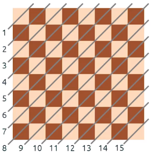

# Eight Queens Problem

Wikipedia concisely states:

> The eight queens puzzle is the problem of placing eight chess queens on an 8×8 chessboard so that no two queens threaten each other; thus, a solution requires that no two queens share the same row, column, or diagonal.

# Requirements 

Obviously, the first requirement is that 8 queens need to be placed somewhere on the chessboard. Since there are only 8 rows and 8 columns and no two queens are allowed to be in the same row or column , we can say that a queen must be placed in each row and a queen must be placed in each column. To fully specify these requirements, we will need 16 distinct requirements:

``` text
('queen in row', 1)
('queen in col', 1)
('queen in row', 2)
('queen in col', 2)

[…]

('queen in row', 8)
('queen in col', 8)
```

But, what about the diagonals? Take a look at the following image I found on [math.stackexchange.com]( https://math.stackexchange.com/questions/2811398/how-do-i-calculate-how-many-ways-14-non-attacking-bishops-can-be-placed-on-a-che)



There are 15 diagonals on the image and those are just the up-and-to-the-right diagonals. That doesn’t include another 15 down-and-to-the-right diagonals. We only have 8 queens, making it impossible to fully cover either set of 15 diagonals. However, if a diagonal is occupied by a queen, it is critical that no other queen be in that same diagonal.

These diagonals perfectly fit the definition of an optional requirement. While rows and columns on the board __must__ have exactly one queen, the diagonals __may or may not__ have a queen, but if a diagonal is covered by a queen, it __must not__ be covered by more than one queen.

The picture above assigns a unique integer to each of the up-and-to-the-right diagonals. For completeness, let’s assign the numbers 16 to 30 to the down-and-to-the-right diagonals, starting in the bottom-left corner. This results in the following 30 distinct _optional requirements_:

``` text
('queen in diagonal', 1)
('queen in diagonal', 2)
('queen in diagonal', 3)

[…]

('queen in diagonal', 28)
('queen in diagonal', 29)
('queen in diagonal', 30)
```

Our complete set of requirements looks like this:

```text
requirements = 8 rows + 8 columns

optional_requirements = 30 diagonals
```

# Actions


